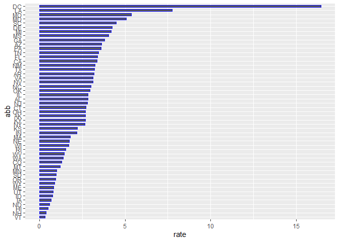
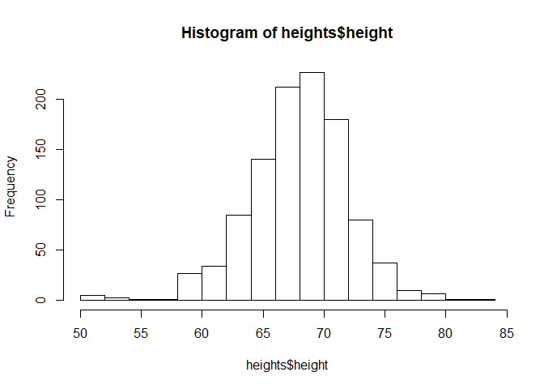

Report on Gun Murders
================
Hugo Aquino
2020-08-22

## Introduction

This is a report on 2010 gun murder rates obtained from FBI reports. The
original data was obtained from [this Wikipedia
page](https://en.wikipedia.org/wiki/Murder_in_the_United_States_by_state).

We are going to use the following library:

    ## Warning: package 'tidyverse' was built under R version 3.6.3

    ## -- Attaching packages ---------------------------- tidyverse 1.3.0 --

    ## v ggplot2 3.3.2     v purrr   0.3.4
    ## v tibble  3.0.3     v dplyr   1.0.2
    ## v tidyr   1.1.1     v stringr 1.4.0
    ## v readr   1.3.1     v forcats 0.5.0

    ## Warning: package 'ggplot2' was built under R version 3.6.3

    ## Warning: package 'tibble' was built under R version 3.6.3

    ## Warning: package 'tidyr' was built under R version 3.6.3

    ## Warning: package 'readr' was built under R version 3.6.3

    ## Warning: package 'purrr' was built under R version 3.6.3

    ## Warning: package 'dplyr' was built under R version 3.6.3

    ## Warning: package 'stringr' was built under R version 3.6.3

    ## Warning: package 'forcats' was built under R version 3.6.3

    ## -- Conflicts ------------------------------- tidyverse_conflicts() --
    ## x dplyr::filter() masks stats::filter()
    ## x dplyr::lag()    masks stats::lag()

    ## Warning: package 'dslabs' was built under R version 3.6.3

and load the data we already wrangled:

## Murder rate by state

We note the large state to state variability by generating a barplot
showing the murder rate by state:

<!-- -->

``` r
hist(heights$height)
```

<!-- -->
